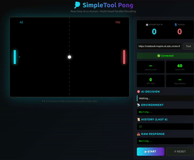
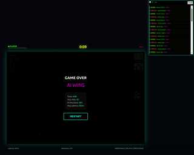

<p align="center">
  <a href="README.md">English</a> | <a href="README_zh.md">中文</a>
</p>
<h1 align="center">SimpleTool</h1>

<p align="center">
  <b>Parallel Decoding for Real-Time LLM Function Calling</b>
</p>

<p align="center">
  <a href="https://arxiv.org/abs/xxxx.xxxxx"></a>
  <a href="https://huggingface.co/Cialtion/SimpleTool"></a>
  <a href="https://www.modelscope.cn/models/cialtion/SimpleTool"></a>
  <a href="#license"></a>
</p>

<p align="center">
  LLM based 4B-size model <b>16Hz real-time function calling</b>
</p>

---

SimpleTool enables **real-time LLM function calling** through parallel decoding. By introducing special tokens that compress redundant output (4-6×) and enable independent generation of function name and arguments, we achieve **3-6× end-to-end speedup** while maintaining competitive accuracy.

<p align="center">
  
</p>

## How It Works

Traditional function calling generates tokens sequentially: `function → arg1 → arg2 → ...`, resulting in latency that scales linearly with output length. SimpleTool exploits two key observations:

1. **Token Redundancy**: Structured outputs contain predictable tokens (brackets, parameter names) that can be compressed into special tokens
2. **Weak Causal Dependencies**: Function arguments are largely independent and can be generated in parallel

<p align="center">
  
</p>

By decoding function name and arguments as parallel streams sharing the same prefix KV cache, latency becomes `max(head_time)` instead of `sum(token_times)`.   
The parallel heads utilize idle compute capacity within the memory-bandwidth-bound decode phase, making parallelization nearly free.

For more details, see our [arXiv paper](https://arxiv.org/abs/xxxx.xxxxx).

---

## Quick Start

### 1. Setup Environment

```bash
git clone https://github.com/HaxxorCialtion/SimpleTool.git
cd SimpleTool

uv venv env_rt -p python3.12
source env_rt/bin/activate  # Linux

uv pip install -r requirements.txt
```

### 2. Download Model (AWQ Quantized)

| Model | Params | Latency | HuggingFace | ModelScope |
|-------|--------|---------|-------------|------------|
| RT-Qwen2.5-0.5B-AWQ | 0.5B | ~30ms | [🤗](https://huggingface.co/Cialtion/SimpleTool/tree/main/RT-Qwen2.5-0.5B-AWQ) | [Link](https://www.modelscope.cn/models/cialtion/SimpleTool/tree/master/RT-Qwen2.5-0.5B-AWQ) |
| RT-Qwen2.5-1.5B-AWQ | 1.5B | ~40ms | [🤗](https://huggingface.co/Cialtion/SimpleTool/tree/main/RT-Qwen2.5-1.5B-AWQ) | [Link](https://www.modelscope.cn/models/cialtion/SimpleTool/tree/master/RT-Qwen2.5-1.5B-AWQ) |
| RT-Qwen2.5-3B-AWQ | 3B | ~50ms | [🤗](https://huggingface.co/Cialtion/SimpleTool/tree/main/RT-Qwen2.5-3B-AWQ) | [Link](https://www.modelscope.cn/models/cialtion/SimpleTool/tree/master/RT-Qwen2.5-3B-AWQ) |
| RT-Qwen3-4B-AWQ | 4B | ~60ms | [🤗](https://huggingface.co/Cialtion/SimpleTool/tree/main/RT-Qwen3-4B-AWQ) | [Link](https://www.modelscope.cn/models/cialtion/SimpleTool/tree/master/RT-Qwen3-4B-AWQ) |
| RT-Qwen2.5-7B-AWQ | 7B | ~70ms | [🤗](https://huggingface.co/Cialtion/SimpleTool/tree/main/RT-Qwen2.5-7B-AWQ) | [Link](https://www.modelscope.cn/models/cialtion/SimpleTool/tree/master/RT-Qwen2.5-7B-AWQ) |
| RT-Qwen2.5-14B-AWQ | 14B | ~130ms | [🤗](https://huggingface.co/Cialtion/SimpleTool/tree/main/RT-Qwen2.5-14B-AWQ) | [Link](https://www.modelscope.cn/models/cialtion/SimpleTool/tree/master/RT-Qwen2.5-14B-AWQ) |
| RT-Qwen3-30B-A3B-AWQ | 30B-A3B | ~ | [🤗](https://huggingface.co/Cialtion/SimpleTool/tree/main/RT-Qwen3-30B_awq_w4a16) | [Link](https://www.modelscope.cn/models/cialtion/SimpleTool/tree/master/RT-Qwen3-30B_awq_w4a16) |

> Latency measured on RTX 4090 with vLLM prefix caching

```bash
mkdir models
# Download with huggingface-cli
huggingface-cli download Cialtion/SimpleTool --include "RT-Qwen3-4B-AWQ/*" --local-dir ./models

# Or with modelscope
modelscope download --model cialtion/SimpleTool --include "RT-Qwen3-4B-AWQ/*" --local_dir ./models
```

### 3. Start Server

Edit `MODEL_PATH` in `rt_server.py`, then:

```bash
python rt_server.py
```

```
╔══════════════════════════════════════════════════════════════════════╗
║          SimpleTool vLLM-Server v1.0                                 ║
║          Having a Realtime LLM based control time!                   ║
║                                                                      ║
║   Run Demos: Open demos/*.html in browser                            ║
║   Build New: Send simpletool-game-guide.md to AI (Claude, Gemini...) ║
║              for building your own HTML games                        ║
╚══════════════════════════════════════════════════════════════════════╝
```

Server runs at `http://localhost:8899`.

### 4. Run Demos

Open in your browser:

| Demo | Description | File |
|------|-------------|------|
| **Pong** | AI vs Human paddle game | `demos/pong_game.html` |
| **Neon Arena** | Multi-AI battle shooter | `demos/neon_arena.html` |

For Neon Arena or other games with extra assets:
```bash
cd ./demos/neon_arena
python3 -m http.server 8080 --bind 127.0.0.1
```
Then open <http://127.0.0.1:8080/neon_arena.html>   
and enter your SimpleTool server URL (default: `http://localhost:8899`).   
Try to beat the LLM-based AIs!
<p align="center">
  
  
</p>

---

## Build Your Own Game

Want to create a new real-time AI game? Use AI coding assistants (Claude, GPT, etc.) with **`simpletool_game_guide.md`** as context. It contains:

- Server API specification
- Tool definition format
- Query design best practices
- Frontend code templates
- Dynamic head optimization

---

## TODO

- [ ] Native Windows support
- [ ] iOS deployment
- [ ] Powerful World Simulation
- [ ] Embodied Avatars

---

## Citation

Coming soon

## License

Apache 2.0